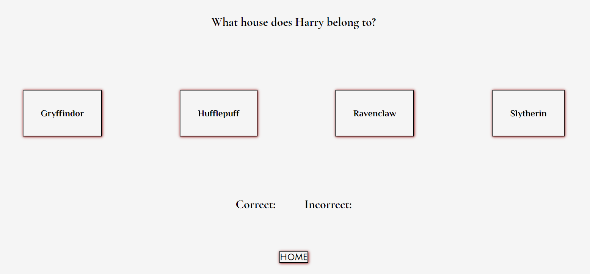

# Potter Quiz

## Intro
The Potter Quiz game is for Harry Potter fans to test their knowledge on the three main characters: Harry Potter, Ron Weasley and Hermione Granger.
The website consists of three games for each of the characters. When selecting Begin Quiz for each character, the player will be presented with a question and multiple-choice answers. When the player selects an answer, they will be informed if they are correct or incorrect. They will be able to keep a tally of their scores across each game which will be visible to the player at the footer of the page. The player can replay these games to try and beat their scores as many times as they wish.

This game is targeted at Harry Potter fans of all ages.

   

  

## User Experience Stories

 - As a user/player I want to test my knowledge on the three main characters of Harry Potter.
 - As a user/player I want to understand how to play the game.
 - As a user/player I want to try and beat my score each time.

## Design

- __Color Scheme__
 - There are two primary colors used throughout the game. They are black and white smoke. 
 - The supporting colors which are used for box-shadows around the buttons are dark red and dark grey.
 - The Header and Footer have a black background with white smoke font.
 - The Main Content and Quiz Area have a white smoke background with black font.

- __Typography__
 - The fonts Philosopher and Julius Sans One are used for the Header and h2 headers throughout the game to keep consistency. They are clear and fit with the Harry Potter magic theme.
 - The font Cormorant Garamond is used for the remaining text. This is also clear text and fits with the Harry Potter theme, closely resembling the font used for the text within the Harry Potter books.
 - The font sans-serif is set as the fallback for all fonts in the instance the browser does not import the fonts correctly.

## Features 

### Existing Features

- __Header__
  
  - The Header encompasses the title of the game. It located at the top of the page with the title centered.
  - The Header has a black background with white smoke font which which is clear and stands out to the player. 
  - The font is capitalized to clearly identify to the player its the title of the game. 

  

- __Welcome Section__

  - The Welcome Section introduces the player to the game. It includes a How to Play section which talks the player through the steps to start the game. It also informs them they can play as many times as they wish to try and beat their previous score and that their final score from each attempt at a game will display at the bottom of the page.
  - The font is black on a white smoke background which is clear for the player to read.
  - Its located before the Create Username section so that the player understands they are required to create a username to start playing.

  

- __Username Section__

  - The Username section encompases a title asking the player to create a username, an input field for the player to enter a username and a button to create the username.
  - The font is black on white background which is clear and stands out to the player.
  - This section is located at the top of the page before the player reaches the game itself. 
  - The player is also unable to enter a blank value within the username field, if they attempt to do this an alert will appear once Create is selected informing the player they are required to enter a valid username.

  
    

- __Game Area__

 - Main Contents:
    - The Main Contents of the Game Area Section consists of the three game choices for the player, defined in 3 clear sections which are either stacked vertically on smaller screens or horizontally on larger screens.
    - The 3 sections are identified to the player with:
      - a title of the character.
      - a short paragraph asking the player to test their knowledge on the character.
      - an image of the character.
      - a button labelled 'Begin Quiz'.
    - All font within the Main Contents are black on white background which is clear for the player.
    - The button has a box-boarder shadow of dark red.

    
    

  - Quiz Area: 
    - The Quiz Area of the Game Area Section is hidden initially to the player. Once the player selects a game choice the Quiz Section for that game choice appears and replaces the Main Contents section of the Game Area.
    - The Quiz Area consists of:
      - A question for the player.
      - 4 answer choices in the form of buttons. These are either stacked vertically on smaller screens or horizontally on larger screens.
      - A home button for the player to return to the Main Contents.
      - A score board labelled with 'Correct' and 'Incorrect'. The value of the relative label will increase after each question depending on if the player selects the correct or incorrect answer. If the player replays the game the score for both 'Correct' and 'Incorrect' will reset to 0.
    - All font within the Quiz Area is black on white background which is clear for the player.
    - If the player exists the game and selects 'Begin Quiz' again the game resets back to the start and the player starts the game again.

    
    
  

- __Footer__

  - The aim of this section is showcase the total score of each game once each game has completed.
  - The background is black with white font to mimic the Header of the game and make the text clear for the player to read.
  - If the player attempts a game again and receives a new score, the corresponding total score will be replaced with the new score.

  
  

### Features Left to Implement

  - Further quiz games under the following categories;
    - Other Harry Potter characters.
    - To sort the player into a Hogwarts House depending on the answers they choose.
  - Further levels for each game so that the player can progress further.
  - Create a timer feature to set a limit on how long the player has to complete the quiz.
  - Animation on the home screen when the player firsts accesses the site.
  - The player is informed of the correct answers when selecting an incorrect answer in the game.
  - Receive a final score which is a combination of all 3 total scores after completing all 3 games.

## Testing 

  - I have tested the game in the following browsers to confirm it works across different browsers:
    - Safari
    - Chrome
    - Mozilla Firefox
    - Microsoft Edge

  - Through the use of DevTools I can confirm that the site is responsive across the standard screen sizes;
    - Mobile < = 768px
    - Tablet > = 768px
    - Laptop > = 992px
    - Desktop > = 1200px

  - I confirm that the Header and Footer are clearly defined to the player and easy to read. The rules of the game are clearly layed out and the function of the game is simple to navigate. 

  - I have tested that the create username input works and that the input is required to be a valid string input of at least one index.

  - I have tested that the player is required to create a username before they can proceed with playing the game.

  - I have tested each quiz to ensure that all questions appear correctly, that the checkAnswer function works and identifies the correct answer for the choice selected by the player. I have checked that when either the correct or incorrect selection is identified, the relevant score increments correctly.

  - I have run each game whilst checking to the console to ensure no errors appear and that all console.logs have been removed from the code. 
  
  - I have tested that the correct alert message appears depending on the score the player achieves;
    - If the player achieves 0 correct scores the alert message offers condolences.
    - If the player achieves some correct scores and some incorrect scores the alert message congratulates the player but suggests they play again and try and beat the score.
    - If the player achieves 10 out of 10 correct they are congratulated but not offered to beat their score as this is not possible.
  
  - I have tested that when replaying a game:
    - The total score within the footer resets back to 0.
    - The values for correct and incorrect within the scoreboard reset back to 0.
    - The questions and corresponding choices reset back to question one.

### Validator Testing 

  - __HTML__
    - No errors were returned when passing HTML code from index.html through the official W3C validator.

      

  - __CSS__
    - No errors were returned when passing through the official (Jigsaw) validator.

      

  - __JavaScript__
    - Have run the javascript code through jshint.
    - Warnings have appeared but no errors.
    - The warnings have stated that the variables and syntaxes used are only available in ES6. I do not believe any action is required here as it is not affecting the running of my code
    - The warnings have also stated unnecessary semicolons - these have been at the end of functions.
    - I have decided to leave them in because it does not affect the running of my code.

      

  - __Accessibility__
    - By running the game through lighthouse in Chrome DevTools I was able to confirm:
      - The fonts and colors chosen throughout the game are easy to read and accessible.
      - The buttons and input elements were accessible throughout the game.

      

## Bugs

### Fixed Bugs

  - displayHarryQuestions function not running:
    - When testing the function by selecting the Begin Quiz for Harry Questions, received an error within the console stating it could not 'set properties of null (setting 'textContent)
    - Through using chrome DevTools I found the line of the function that the error derived from. I discovered this was due to an incorrect spelling of an Id name.
    - I changed this to correct spelling of the Id 'question'. 
    - Correcting the spelling fixed the problem.

    
  
  - Game not restarting or refreshing:
    - When running the game, exiting the game and re-entering the game, I found it continued from the question in the game I had left it on. Also, once completing the game, navigating back to home and then re-loading the game, the game did not restart, it displayed the last question with the last choice selected.
    - Through the use of console.logs I discovered that the current question index was not reverting back to 0.
    - Added the following line of code to the end of the function calling the next question 'currentQuestion = 0' so that once the final question had been called, the question index would revert to 0 and the first question would be called again. I then added the same line of code to the end of the function used to navigate back to the home screen, so that if called because the player decided to leave the game early, it would set the current question index back to 0, and when navigating back to the game the first question would be called again.
    - Adding this same line of code to the two separate functions resolved the issue.
  
  - duplication of score cards:
    - I found that each time the Begin Quiz function was called an additional h3 element was being added to the score card.
    - This was due to a part of the function to display the questions which creates the h3 element to display the score number. Each time the function was called it was creating another h3 element.
    - I resolved this through creating a function which removes the h3 element when the game has ended and the player navigates back to home. 
  
  - default button settings on mobile devices:
    - When testing the quiz on a mobile device I found that the button styles I had applied using CSS were not displaying. Instead, the default browser button styles were showing.
    - I searched online for some potential solutions and attempted to resolve by adding -webkit-appearance: none to the button styling within CSS. The buttons were still showing in their default styling.
    - I realised I had not set a background color or font color for the buttons. Applied this to all buttons and the styling I had applied within the CSS file was now showing on mobile devices. This resolved the issue.
  
  - Score card not resetting when starting a new game:
    - Found that when restarting a game, the correct and incorrect scores were not resetting. Instead, they continued to update.
    - Created a function 'resetScore' to update the input for correct and incorrect score to 0, and applied this function to the home function so that when leaving the game, the scores reset.
  
  - Extra space being created after each question:
    - When running through the questions in each game, space between the question and the heading displaying the username was increasing.
    - Through chrome DevTools I noticed these were blank h3 elements.
    - Through checking the display question function, I found this was due to part of the function creating the heading to display the question, each time the display question function was run it was creating a new h3 element below the last.
    - Resolved this through creating a separate function to create the h3 element, and then calling the display question function within the new function. This resolved the issue of duplicate h3 elements being created.

  - Total score not resetting after each run of the game:
    - Found that the total score displayed in the footer was not resetting to 0 if a game was replayed.
    - Set totalScoreNumber as a global variable so that multiple functions could access it. Applied totalScoreNumber.textContent = "0" to the run game function so that if this function is called the total score goes back to 0.

### Unfixed Bugs

  - No unfixed bugs.

## Deployment

This section should describe the process you went through to deploy the project to a hosting platform (e.g. GitHub) 

- The site was deployed to GitHub pages. The steps to deploy are as follows: 
  - In the GitHub repository, navigate to the Settings tab 
  - From the source section drop-down menu, select the Master Branch
  - Once the master branch has been selected, the page will be automatically refreshed with a detailed ribbon display to indicate the successful deployment. 

The live link can be found here - https://cgalpin92.github.io/project2-potterquiz/

## Credits 

### Content 

  - The questions used within each game were sourced from BuzzFeed:
    - https://github.com/cgalpin92/project-portfolio1-moonlandingmuseum/blob/main/README.md?plain=1
    - https://www.buzzfeed.com/sanjanaashokvarda/can-you-ace-this-hermione-granger-trivia-quiz 

  - Code sourced or guidance taken from SheCodes:
    - Targetting a button selection - https://www.shecodes.io/athena/7288-how-to-target-only-one-button-while-writing-in-javascript#:~:text=In%20JavaScript%2C%20you%20can%20use,through%20the%20addEventListener()%20method.&text=This%20attaches%20the%20function%20to,in%20the%20myFunction()%20body.
    - For replacing the form with the entered username - https://www.shecodes.io/athena/5824-how-to-change-h1-to-the-user-name-submitted-in-search-engine
    - Placing functions within functions - https://www.shecodes.io/athena/1697-can-i-place-a-function-in-another-function-in-javascript#:~:text=Yes%2C%20a%20function%20can%20be,function%20and%20example%20code%20provided

  - Code sourced or guidance taken from w3 schools
    - For hiding and displaying the main content and quiz area - https://www.w3schools.com/howto/howto_js_toggle_hide_show.asp 
    - For validating the form within Javascript and ensure a valid username is created before the player can start the game - https://www.w3schools.com/js/js_validation.asp

  - Code sourced or guidance taken from Dev Community:
    - creating the scorecard within the footer - https://dev.to/davidchedrick/creating-a-simple-timer-and-score-keeper-in-javascript-394g 
  
  - Code sourced or guidance taken from Stackoverflow:
    - For creating the check answers function - https://stackoverflow.com/questions/73310918/how-do-i-check-the-answer-of-a-clicked-button-to-see-if-it-matches-the-correct-a 

  - Code sourced or guidance taken from mdn web docs: 
    - For creating an if else else statement used to check the end score and return a value based on the score - https://developer.mozilla.org/en-US/docs/Web/JavaScript/Reference/Statements/if...else

  - Code sourced or guidance taken from Sitepoint community:
    - For the use of if else statements within nextQuestion functions - https://www.sitepoint.com/community/t/resolved-validate-email-with-if-statements/197380

  - Code sourced or guidance taken from geeks for geeks:
    - Guidance for using flexbox to align divs side by side - https://www.geeksforgeeks.org/fluid-width-with-equally-spaced-div-using-css/

  - Code sourced or guidance taken for creating the different functions to display the quiz question and choices:
    - Micorsoft Bing - https://www.bing.com/search?q=how%20to%20use%20a%20loop%20with%20quiz%20questions%20in%20javascript%20so%20that%20only%20one%20question%20shows%20at%20a%20time&qs=n&form=QBRE&=Search%20%7B0%7D%20for%20%7B1%7D&=Search%20work%20for%20%7B0%7D&=%25eManage%20Your%20Search%20History%25E&sp=-1&ghc=1&lq=1&pq=how%20to%20use%20a%20loop%20with%20quiz%20questions%20in%20javascript%20so%20that%20only%20one%20question%20shows%20at%20a%20time&sc=1-93&sk=&cvid=4A54C3DD0B2548A197661244C781B20C&ghsh=0&ghacc=0&ghpl=
                    - https://www.bing.com/search?q=how%20to%20use%20a%20loop%20with%20quiz%20questions%20in%20javascript%20so%20that%20only%20one%20question%20shows%20at%20a%20time&qs=n&form=QBRE&=Search%20%7B0%7D%20for%20%7B1%7D&=Search%20work%20for%20%7B0%7D&=%25eManage%20Your%20Search%20History%25E&sp=-1&ghc=1&lq=1&pq=how%20to%20use%20a%20loop%20with%20quiz%20questions%20in%20javascript%20so%20that%20only%20one%20question%20shows%20at%20a%20time&sc=1-93&sk=&cvid=4A54C3DD0B2548A197661244C781B20C&ghsh=0&ghacc=0&ghpl=

    - Stackoverflow - https://stackoverflow.com/questions/62594459/how-to-check-the-correct-answer-javascript-4-buttons
                    - https://stackoverflow.com/questions/15348725/how-to-make-quiz-questions-appear-one-at-a-time-in-javascript
                    - https://stackoverflow.com/questions/68104582/asking-questions-using-arrays-and-loop

    - envato tuts+ - https://webdesign.tutsplus.com/multiple-choice-quiz-app-with-javascript--cms-107756t

    - sitepoint - https://www.sitepoint.com/simple-javascript-quiz/#thebasicstructureofyourjavascriptquiz 

### Media

  - All profile pictures were taken from Harry Potter Fanzone:

    - Harry Potter Profile Picture - https://www.harrypotterfanzone.com/pictures/harry-potter-order-of-the-phoenix-portrait-17/
    - Ron Weasley Profile Picture - https://www.harrypotterfanzone.com/pictures/ron-weasley-half-blood-prince-portrait-2/
    - Hermione Granger Profile Picture - https://www.harrypotterfanzone.com/pictures/hermione-granger-half-blood-prince-portrait-5/

